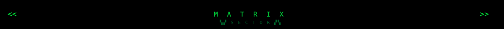
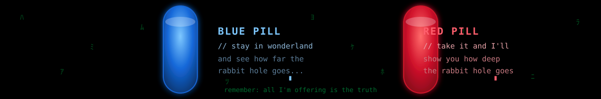

<!-- ═══════════════════════════════════════════════════════════════════════════
     MATRIX PROFILE README · Dhyanesh006
     ═══════════════════════════════════════════════════════════════════════════
     ▸ Everything below is production-ready. You only need to change the four
       "ONLY CHANGE" lines above each link block, and nothing else.
     ▸ STATS: profile/*.svg + profile-summary-card-output/* are generated
       daily by .github/workflows/stats.yml and committed into this repo, so
       they never depend on flaky third-party hosting.
     ▸ STREAK / ACTIVITY / TROPHIES / TYPING / VISITORS: live services that
       auto-update themselves. No action needed.
     ▸ PAC-MAN: .github/workflows/pacman.yml pushes the animated SVG to the
       `output` branch daily. Run it once from Actions ▸ Run workflow after
       the first push.
     ▸ LAST-SYNC STAMP: refreshed daily by .github/workflows/update-readme.yml.
     ▸ QUOTE: refreshed daily by .github/workflows/quote.yml from quotes.json.
     ═══════════════════════════════════════════════════════════════════════════ -->

<!-- ═══════════════════════════════════════════════════════════════════════════
     ▸▸▸ CONFIG — ONLY CHANGE THESE ONCE ◂◂◂
     USERNAME   : Dhyanesh006
     PORTFOLIO  : https://portfolio-dhyanesh.vercel.app/
     EMAIL      : dhyanesh006@gmail.com
     LINKEDIN   : https://www.linkedin.com/in/dhyanesh-v-741738274
     X / TWITTER: https://x.com/dhyanesh
     LOCATION   : Coimbatore, India
     ROLE       : B.E. Computer Science & Engineering Student
     ═══════════════════════════════════════════════════════════════════════════ -->

  

 

<!-- ═══════════════════════════════════════════════════════════════════════════
     1 · WAKE UP — TYPING INTRO
     ═══════════════════════════════════════════════════════════════════════════ -->

  

  
    &gt; wake up, dhyanesh... the matrix has you... follow the white rabbit.
  

  
  
  
  
  

 

<!-- ═══════════════════════════════════════════════════════════════════════════
     BOOT SEQUENCE
     ═══════════════════════════════════════════════════════════════════════════ -->

  
    
matrix v9.99 boot sequence — © 1999-2026

    
&gt; mounting /dev/ideas .......... [ OK ]

    
&gt; loading curiosity.modules .... [ OK ]

    
&gt; starting curiosity.daemon ..... [ OK ]

    
&gt; enabling wifi.warrior .......... [ OK ]

    
&gt; init: coffee.service ........... [ FAIL ]

    
&gt; warning: coffee.service missing — falling back to chai

    
&gt; compiling: dream.exe .......... [ OK ]

    
&gt; all systems nominal. welcome, stranger.

  

 

 

<!-- ═══════════════════════════════════════════════════════════════════════════
     TABLE OF CONTENTS
     ═══════════════════════════════════════════════════════════════════════════ -->

  <a href="#-whoami" style="color:#00e640; text-decoration:none;">$ whoami</a> ·
  <a href="#-about" style="color:#00e640; text-decoration:none;">$ about</a> ·
  <a href="#-the-choice" style="color:#00e640; text-decoration:none;">$ choice</a> ·
  <a href="#-education" style="color:#00e640; text-decoration:none;">$ edu</a> ·
  <a href="#-tech-stack" style="color:#00e640; text-decoration:none;">$ skills</a> ·
  <a href="#-focus" style="color:#00e640; text-decoration:none;">$ focus</a> ·
  <a href="#-github-stats" style="color:#00e640; text-decoration:none;">$ stats</a> ·
  <a href="#-contributions" style="color:#00e640; text-decoration:none;">$ pacman</a> ·
  <a href="#-featured-projects" style="color:#00e640; text-decoration:none;">$ projects</a> ·
  <a href="#-quotes" style="color:#00e640; text-decoration:none;">$ quotes</a> ·
  <a href="#-connect" style="color:#00e640; text-decoration:none;">$ connect</a>

 

<!-- ═══════════════════════════════════════════════════════════════════════════
     $ whoami — TERMINAL INTRO
     ═══════════════════════════════════════════════════════════════════════════ -->
<h2 align="center" style="color:#00ff41; font-family:'Fira Code', monospace;">$ whoami</h2>

  
    ● dhyanesh@matrix-node: ~/github
  

  

    ┌─────────────────────────────────────────────────────┐ 
    │ dhyanesh@matrix-node:~/profile ┐ 
     
    $ whoami 
    Dhyanesh — Computer Science Engineer 
     
    $ hostname 
    matrix-node 
     
    $ uptime 
    always learning, never down 
     
    $ skills 
    java · spring boot · next.js · react · mysql · git · linux · docker 
     
    $ status 
    [██████████████░░░░░░] 90% — building the future... 
     
    $ exit 
    connection closed.▮ 
     
    └─────────────────────────────────────────────────────┘

  

 

  &gt; welcome to my corner of the matrix — pull up a chair, the rabbit hole runs deep.

 

<!-- ═══════════════════════════════════════════════════════════════════════════
     $ git-log — PROFILE TIMELINE
     ═══════════════════════════════════════════════════════════════════════════ -->
<h2 align="center" style="color:#00ff41; font-family:'Fira Code', monospace;">$ git log</h2>

  
    
commit f00d123 (HEAD -&gt; main)

    
&nbsp;&nbsp;Author: Dhyanesh &lt;dhyanesh006@gmail.com&gt;

    
&nbsp;&nbsp;&nbsp;&nbsp;wake up, neo.

    
commit a11ce01

    
&nbsp;&nbsp;Author: Dhyanesh &lt;dhyanesh006@gmail.com&gt;

    
&nbsp;&nbsp;&nbsp;&nbsp;follow the white rabbit.

    
commit b01d0c0

    
&nbsp;&nbsp;Author: Dhyanesh &lt;dhyanesh006@gmail.com&gt;

    
&nbsp;&nbsp;&nbsp;&nbsp;take the red pill — stay in wonderland.

    
commit d3adbee

    
&nbsp;&nbsp;Author: Dhyanesh &lt;dhyanesh006@gmail.com&gt;

    
&nbsp;&nbsp;&nbsp;&nbsp;the matrix has you...

  

 

 

<!-- ═══════════════════════════════════════════════════════════════════════════
     $ about — ABOUT ME
     ═══════════════════════════════════════════════════════════════════════════ -->
<h2 align="center" style="color:#00ff41; font-family:'Fira Code', monospace;">$ about</h2>

  
    

      >_ init — I'm a B.E. Computer Science &amp; Engineering student
      based in Coimbatore, India, building full-stack applications
      that feel like they escaped the mainframe.
    

    

      >_ stack — Java, Spring Boot, React, Next.js, TypeScript and the usual
      terminals of tools that glue them together.
    

    

      >_ security — I walk the wire: cybersecurity &amp; ethical hacking,
      always probing my own systems before anyone else does.
    

    

      >_ networks — packets, subnets and cloud (AWS) — I like to know
      how the signal travels from one node to the next.
    

    

      >_ mission — build scalable, real-world applications, one commit at
      a time.       the rabbit hole runs deep.
    

  

 

<!-- ═══════════════════════════════════════════════════════════════════════════
     $ philosophy
     ═══════════════════════════════════════════════════════════════════════════ -->
<h2 align="center" style="color:#00ff41; font-family:'Fira Code', monospace;">$ philosophy</h2>

  
    
# my rules of the matrix

    
01 there is no spoon — write code that solves the real problem, not the imagined one.

    
02 follow the white rabbit — curiosity beats certainty. keep learning relentlessly.

    
03 the code is the truth — ship clean, tested, readable systems.

    
04 only the human mind is the source — software is a means, people are the end.

  

 

  

 

<!-- ═══════════════════════════════════════════════════════════════════════════
     $ the choice
     ═══════════════════════════════════════════════════════════════════════════ -->
<h2 align="center" style="color:#00ff41; font-family:'Fira Code', monospace;">$ the choice</h2>

  
    

      # This is your last chance. After this, there is no turning back.
    

    

      # You take the blue pill — the story ends, you wake up in your bed and believe whatever you want to believe.
    

    

      # You take the red pill — you stay in Wonderland, and I show you how deep the rabbit hole goes.
    

    

      &gt; remember: all I'm offering is the truth.
    

  

 

 

<!-- ═══════════════════════════════════════════════════════════════════════════
     $ education
     ═══════════════════════════════════════════════════════════════════════════ -->
<h2 align="center" style="color:#00ff41; font-family:'Fira Code', monospace;">$ education</h2>

  
    

      edu.level : B.E. Computer Science &amp; Engineering (pursuing)
    

    

      edu.location : Coimbatore, India
    

    

      cert.2024 : MongoDB · MATLAB (MathWorks) · Microsoft · Bentley
    

    

      cert.2024 : Celonis · Wadhwani Foundation · Professional Development
    

    

      exploring : Cybersecurity · Cloud Computing · Networking
    

  

 

  
  
  
  

 

 

<!-- ═══════════════════════════════════════════════════════════════════════════
     $ skills — TECH STACK
     ═══════════════════════════════════════════════════════════════════════════ -->
<h2 align="center" style="color:#00ff41; font-family:'Fira Code', monospace;">$ skills</h2>

  &gt; loading modules... skills loaded from the mainframe.

<b style="color:#00e640; font-family:'Fira Code', monospace;">lang</b>

  

<b style="color:#00e640; font-family:'Fira Code', monospace;">frontend</b>

  

<b style="color:#00e640; font-family:'Fira Code', monospace;">backend</b>

  

<b style="color:#00e640; font-family:'Fira Code', monospace;">database</b>

  

<b style="color:#00e640; font-family:'Fira Code', monospace;">tools</b>

  

<b style="color:#00e640; font-family:'Fira Code', monospace;">cloud / security</b>

  

  
    

      languages : Java · Python · JavaScript · TypeScript
    

    

      frontend &nbsp;: React · Next.js · Tailwind · Bootstrap · HTML · CSS
    

    

      backend &nbsp;&nbsp;: Spring Boot · Node.js · Express · REST APIs
    

    

      database &nbsp;: MySQL · MongoDB
    

    

      tools &nbsp;&nbsp;&nbsp;&nbsp;: Git · GitHub · VS Code · Docker · Linux · Postman · Figma · Power BI
    

    

      network &nbsp;&nbsp;: Networking · AWS Cloud · Ethical Hacking
    

  

 

  
  
  
  
  
  
  
  
  
  
  

 

 

<!-- ═══════════════════════════════════════════════════════════════════════════
     $ focus — CURRENT FOCUS
     ═══════════════════════════════════════════════════════════════════════════ -->
<h2 align="center" style="color:#00ff41; font-family:'Fira Code', monospace;">$ focus</h2>

  
    
# currently learning

    
✔ Java &amp; Spring Boot (backend)

    
✔ React &amp; Next.js (frontend)

    
✔ Cybersecurity &amp; Ethical Hacking

    
✔ Networking

    
✔ Cloud Computing (AWS)

    
✔ System Design

  

 

  &gt; current streak — feed the graph, the matrix is watching.

  

 

<!-- ═══════════════════════════════════════════════════════════════════════════
     $ road-map — CURRENT ROADMAP
     ═══════════════════════════════════════════════════════════════════════════ -->
<h2 align="center" style="color:#00ff41; font-family:'Fira Code', monospace;">$ road-map</h2>

  &gt; cat ~/roadmap.md — status of the mission

  
    
[x] master the full-stack fundamentals &lt; done &gt;

    
[x] ship a production portfolio &lt; done &gt;

    
[~] deep-dive system design &amp; scalability &lt; in progress &gt;

    
[~] master Spring Boot &amp; microservices &lt; in progress &gt;

    
[~] cybersecurity fundamentals &amp; ethical hacking &lt; in progress &gt;

    
[ ] AWS cloud certifications &lt; next &gt;

    
[ ] open-source contributions &amp; hackathons &lt; next &gt;

  

 

 

<!-- ═══════════════════════════════════════════════════════════════════════════
     $ stats — GITHUB STATS
     ═══════════════════════════════════════════════════════════════════════════ -->
<h2 align="center" style="color:#00ff41; font-family:'Fira Code', monospace;">$ stats</h2>

  &gt; decoding your contributions... hold on to your hat.

  
  

  

  
  

  
  

  

 

<!-- TROPHIES — rendered by the live github-profile-trophy service (matrix theme) -->
<h3 align="center" style="color:#00e640; font-family:'Fira Code', monospace;">achievements.unlocked</h3>

  

 

  
  
  

  
  
  

 

 

<!-- ═══════════════════════════════════════════════════════════════════════════
     $ pacman — CONTRIBUTIONS
     ═══════════════════════════════════════════════════════════════════════════ -->
<h2 align="center" style="color:#00ff41; font-family:'Fira Code', monospace;">$ pacman</h2>

  &gt; pac-man feeding on your contributions — nom nom nom.

  <picture>
    <source media="(prefers-color-scheme: dark)" srcset="https://raw.githubusercontent.com/Dhyanesh006/Dhyanesh006/output/pacman-contribution-graph-dark.svg" />
    <source media="(prefers-color-scheme: light)" srcset="https://raw.githubusercontent.com/Dhyanesh006/Dhyanesh006/output/pacman-contribution-graph.svg" />
    
  </picture>

  
    generated by <a href="https://github.com/abozanona/pacman-contribution-graph" style="color:#00ff41; text-decoration:none;">pacman-contribution-graph</a> · auto-updates every 24h
  

 

 

<!-- ═══════════════════════════════════════════════════════════════════════════
     $ projects — FEATURED PROJECTS
     ═══════════════════════════════════════════════════════════════════════════ -->
<h2 align="center" style="color:#00ff41; font-family:'Fira Code', monospace;">$ projects</h2>

  &gt; ls --featured ./repos

  
    <b style="color:#00ff41;">▚ ./this-repo</b>
    

      The profile you're reading right now — animated digital rain, live stats cards, pac-man graph and a full CI stack in GitHub Actions.
    

    
[github-actions] [svg] [markdown]

    <a href="https://github.com/Dhyanesh006/Dhyanesh006" style="color:#aaff00; text-decoration:none;">view source →</a>
  

  
    <b style="color:#00ff41;">▚ ./portfolio</b>
    

      Personal portfolio website — crafted with Next.js and Tailwind CSS. Clean, fast and fully responsive.
    

    
[next.js] [react] [tailwind]

    <a href="https://github.com/Dhyanesh006/portfolio" style="color:#aaff00; text-decoration:none;">view source →</a>
    &nbsp;·&nbsp;
    <a href="https://portfolio-dhyanesh.vercel.app/" style="color:#00ff41; text-decoration:none;">live demo →</a>
  

  
    <b style="color:#00ff41;">▚ ./rental-hub [locked]</b>
    

      Property rental management platform — a TypeScript monorepo powered by Next.js, React and NestJS.
    

    
[typescript] [next.js] [nestjs] [monorepo]

    <a href="https://github.com/Dhyanesh006/Rental_Hub" style="color:#aaff00; text-decoration:none;">view repo →</a>
  

  
    <b style="color:#00ff41;">▚ ./pcstore [locked]</b>
    

      E-commerce platform for PC parts — Java, Spring Boot and MySQL under the hood. Solid and scalable.
    

    
[java] [spring-boot] [mysql]

    <a href="https://github.com/Dhyanesh006/pcstore" style="color:#aaff00; text-decoration:none;">view repo →</a>
  

  <a href="https://github.com/Dhyanesh006?tab=repositories" style="font-family:'Fira Code', monospace; font-size:13px; color:#00ff41; text-decoration:none;">
    &gt; cat ./repos --all&nbsp;&nbsp;→&nbsp;&nbsp;browse every repository on GitHub
  </a>

 

<!-- ═══════════════════════════════════════════════════════════════════════════
     $ repo-map — REPOSITORY INDEX
     ═══════════════════════════════════════════════════════════════════════════ -->
<h2 align="center" style="color:#00ff41; font-family:'Fira Code', monospace;">$ repo-map</h2>

  &gt; ls -la --index ./repos

| Repo | Core Tech | Stars | Access |
| :--- | :--- | :--- | :--- |
| [Dhyanesh006](https://github.com/Dhyanesh006/Dhyanesh006) | Markdown · SVG · Actions |  | `public` |
| [portfolio](https://github.com/Dhyanesh006/portfolio) | Next.js · React · Tailwind |  | `public` |
| [Rental_Hub](https://github.com/Dhyanesh006/Rental_Hub) | TypeScript · NestJS · Next.js | — | `private` |
| [pcstore](https://github.com/Dhyanesh006/pcstore) | Java · Spring Boot · MySQL | — | `private` |

 

<!-- ═══════════════════════════════════════════════════════════════════════════
     $ automation — HOW THIS PROFILE STAYS ALIVE
     ═══════════════════════════════════════════════════════════════════════════ -->
<h2 align="center" style="color:#00ff41; font-family:'Fira Code', monospace;">$ automation</h2>

  &gt; systemd list-units --type=service --state=running

  
    
UNIT&nbsp;&nbsp;&nbsp;&nbsp;&nbsp;&nbsp;&nbsp;&nbsp;&nbsp;&nbsp;&nbsp;&nbsp;&nbsp;&nbsp;&nbsp;&nbsp;&nbsp;&nbsp;&nbsp;&nbsp;&nbsp;&nbsp;&nbsp;&nbsp;&nbsp;STATE&nbsp;&nbsp;&nbsp;SCHEDULE

    
pacman.service&nbsp;&nbsp;&nbsp;&nbsp;&nbsp;&nbsp;&nbsp;&nbsp;&nbsp;&nbsp;&nbsp;&nbsp;running&nbsp;&nbsp;&nbsp;00:00 UTC — animated contribution graph → `output` branch

    
stats.service&nbsp;&nbsp;&nbsp;&nbsp;&nbsp;&nbsp;&nbsp;&nbsp;&nbsp;&nbsp;&nbsp;&nbsp;&nbsp;running&nbsp;&nbsp;&nbsp;00:30 UTC — commits stats cards into ./profile

    
quote.service&nbsp;&nbsp;&nbsp;&nbsp;&nbsp;&nbsp;&nbsp;&nbsp;&nbsp;&nbsp;&nbsp;&nbsp;&nbsp;running&nbsp;&nbsp;&nbsp;18:30 UTC — writes the daily quote into this README

    
sync.service&nbsp;&nbsp;&nbsp;&nbsp;&nbsp;&nbsp;&nbsp;&nbsp;&nbsp;&nbsp;&nbsp;&nbsp;&nbsp;&nbsp;running&nbsp;&nbsp;&nbsp;06:00 UTC — refreshes the last-sync stamp below

  

  &gt; every service lives in .github/workflows/ and re-runs automatically — the profile refreshes itself while you sleep.

 

 

<!-- ═══════════════════════════════════════════════════════════════════════════
     $ quotes
     ═══════════════════════════════════════════════════════════════════════════ -->
<h2 align="center" style="color:#00ff41; font-family:'Fira Code', monospace;">$ quotes</h2>

  <!-- QUOTE:START -->
  <em>&ldquo;Don't be sorry. Be better.&rdquo;</em>
   
  &mdash; Kratos, God of War (Game)
  <!-- QUOTE:END -->

  &gt; quote://daily — refreshed every 24 hours by github-actions.

 

  
    
&gt; "There is no spoon."

    
&nbsp;&nbsp;&mdash; The Matrix

    
&gt; "The Matrix is the world that has been pulled over your eyes to blind you from the truth."

    
&nbsp;&nbsp;&mdash; Morpheus, The Matrix

    
&gt; "You have to let it all go, Neo. Fear, doubt, and disbelief."

    
&nbsp;&nbsp;&mdash; Morpheus, The Matrix

  

 

 

<!-- ═══════════════════════════════════════════════════════════════════════════
     $ connect
     ═══════════════════════════════════════════════════════════════════════════ -->
<h2 align="center" style="color:#00ff41; font-family:'Fira Code', monospace;">$ connect</h2>

  &gt; establishing uplink... channels open:

  
  
  
  
  

  
    &gt; ping me if you want to build something cool, break something safe, or just talk tech over coffee.
  

 

  
    
# uplink.conf

    
[matrix]

    
&nbsp;&nbsp;user = Dhyanesh006

    
&nbsp;&nbsp;name = Dhyanesh

    
&nbsp;&nbsp;host = Coimbatore, India

    
&nbsp;&nbsp;email = dhyanesh006@gmail.com

    
&nbsp;&nbsp;portfolio = https://portfolio-dhyanesh.vercel.app/

    
&nbsp;&nbsp;linkedin = https://www.linkedin.com/in/dhyanesh-v-741738274

    
&nbsp;&nbsp;status = [ ONLINE ]

  

 

 

<!-- ═══════════════════════════════════════════════════════════════════════════
     $ signal — OPEN TO
     ═══════════════════════════════════════════════════════════════════════════ -->
<h2 align="center" style="color:#00ff41; font-family:'Fira Code', monospace;">$ signal</h2>

  &gt; currently accepting transmissions:

  
    
[+] internships &amp; junior full-stack roles

    
[+] open-source collaborations

    
[+] hackathons &amp; team projects

    
[+] cybersecurity &amp; cloud learning groups

    
&gt; channel: open — drop a line via the connect section above.

  

 

<!-- ═══════════════════════════════════════════════════════════════════════════
     FOOTER — EXIT SEQUENCE
     ═══════════════════════════════════════════════════════════════════════════ -->

  

  
    <pre style="margin:0; font-family:'Fira Code', Consolas, monospace; font-size:13px; line-height:1.4; color:#00ff41; text-align:left;">
#     #   #  ##### #### ### #   #
##   ##  # #    #   #   #  #  #   #
# # # # #   #   #   ####   #   # # 
#  #  # #####   #   #  #   #    #  
#     # #   #   #   #   #  #   # # 
#     # #   #   #   #   # ### #   #</pre>
    

      &gt; there is no spoon
    

  

<h2 align="center" style="color:#00ff41; font-family:'Fira Code', monospace;">$ exit</h2>

  $ disconnect 
  connection closed. 
  see you in the matrix.▮

  <!-- UPDATE:START -->
  [ matrix://last.sync ]&nbsp; Last updated: 2026-08-06 18:02 IST
<!-- UPDATE:END -->

  &gt; crafted in the matrix · powered by green pixels &amp; strong coffee

 
