

  

  

  

<!-- ═══════════════════════════════════════════════════════════════ -->

## 01 · BOOT SEQUENCE

  

<!-- ═══════════════════════════════════════════════════════════════ -->

## 02 · ABOUT ME

  

  

<!-- ═══════════════════════════════════════════════════════════════ -->

## 03 · TECH STACK

  

<!-- ═══════════════════════════════════════════════════════════════ -->

## 04 · STATS

  
   
  

> Auto-refreshed daily from the GitHub API by [`.github/scripts/generate-stats.mjs`](https://github.com/Dhyanesh006/Dhyanesh006/blob/main/.github/scripts/generate-stats.mjs) — pure SVG + SMIL, no external card services.

<!-- ═══════════════════════════════════════════════════════════════ -->

## 05 · TROPHIES & ACHIEVEMENTS

  

<!-- ═══════════════════════════════════════════════════════════════ -->

## 06 · PAC-MAN — DAILY CONTRIBUTION GRAPH

<picture>
  <source media="(prefers-color-scheme: dark)" srcset="https://raw.githubusercontent.com/Dhyanesh006/Dhyanesh006/output/pacman-contribution-graph-dark.svg" />
  <source media="(prefers-color-scheme: light)" srcset="https://raw.githubusercontent.com/Dhyanesh006/Dhyanesh006/output/pacman-contribution-graph.svg" />
  
</picture>

  Generated by <a href="https://github.com/abozanona/pacman-contribution-graph" style="color:#00ff41; text-decoration:none;">pacman-contribution-graph</a> · auto-updates every 24 hours

<!-- ═══════════════════════════════════════════════════════════════ -->

## 07 · FEATURED PROJECTS

  <a href="https://github.com/Dhyanesh006/Dhyanesh006">
    
  </a>
  <a href="https://github.com/Dhyanesh006/portfolio">
    
  </a>
  <a href="https://github.com/Dhyanesh006/rentalhub">
    
  </a>
  <a href="https://github.com/Dhyanesh006/pc-store">
    
  </a>

> More projects are on the way — most are still private while they bake.

<!-- ═══════════════════════════════════════════════════════════════ -->

## 08 · LEARNING ROADMAP

  

<!-- ═══════════════════════════════════════════════════════════════ -->

## 09 · DAILY QUOTE

<!-- QUOTE:START -->

  

  <!-- QUOTE:END -->

<!-- ═══════════════════════════════════════════════════════════════ -->

## 10 · CONNECT

  
  
  
  
  
  
  
  

<!-- ═══════════════════════════════════════════════════════════════ -->

## 11 · MATRIX REFERENCES

  

The banner, dividers, terminals, project cards and connect badges are original animated SVGs living in [`assets/`](https://github.com/Dhyanesh006/Dhyanesh006/tree/main/assets) — pure SVG + SMIL, no JavaScript, no external services. The stats, activity and daily quote auto-update through the workflows in [`.github/workflows/`](https://github.com/Dhyanesh006/Dhyanesh006/tree/main/.github/workflows).

<!-- ═══════════════════════════════════════════════════════════════ -->

## FOOTER

  

 

  Made with &hearts; in the Matrix · <a href="https://github.com/Dhyanesh006/Dhyanesh006" style="color:#00ff41; text-decoration:none;">view source</a>

