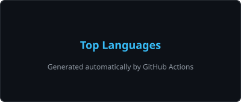

  

  

  

<!-- ═══════════════════════════════════════════════════════════════ -->

## 01 · BOOT SEQUENCE

  

<!-- ═══════════════════════════════════════════════════════════════ -->

## 02 · ABOUT ME

  

  

  
  
  
  

<!-- ═══════════════════════════════════════════════════════════════ -->

## 03 · TECH STACK

**Languages**

  

**Frontend**

  

**Backend**

  

**Database**

  

**Tools**

  

**Networking & Cloud**

  

<!-- ═══════════════════════════════════════════════════════════════ -->

## 04 · STATS

  
  
   
  

<!-- ═══════════════════════════════════════════════════════════════ -->

## 05 · STREAK

  

<!-- ═══════════════════════════════════════════════════════════════ -->

## 06 · ACTIVITY GRAPH

  

<!-- ═══════════════════════════════════════════════════════════════ -->

## 07 · TROPHIES & ACHIEVEMENTS

  
  
  
  
  
  
  
  

<!-- ═══════════════════════════════════════════════════════════════ -->

## 08 · PAC-MAN — DAILY CONTRIBUTION GRAPH

<picture>
  <source media="(prefers-color-scheme: dark)" srcset="https://raw.githubusercontent.com/Dhyanesh006/Dhyanesh006/output/pacman-contribution-graph-dark.svg" />
  <source media="(prefers-color-scheme: light)" srcset="https://raw.githubusercontent.com/Dhyanesh006/Dhyanesh006/output/pacman-contribution-graph.svg" />
  
</picture>

  Generated by <a href="https://github.com/abozanona/pacman-contribution-graph" style="color:#00ff41; text-decoration:none;">pacman-contribution-graph</a> · auto-updates every 24 hours

<!-- ═══════════════════════════════════════════════════════════════ -->

## 09 · FEATURED PROJECTS

| Project | Stack | Links |
| --- | --- | --- |
| [**Dhyanesh006**](https://github.com/Dhyanesh006/Dhyanesh006) | Markdown · SVG · GitHub Actions |  |
| [**portfolio**](https://github.com/Dhyanesh006/portfolio) | Next.js · React · Tailwind |  · [live demo](https://portfolio-dhyanesh.vercel.app/) |

> More projects are on the way — most are still private while they bake.

<!-- ═══════════════════════════════════════════════════════════════ -->

## 10 · LEARNING ROADMAP

  

<!-- ═══════════════════════════════════════════════════════════════ -->

## 11 · CONNECT

  
  
  
  
  
  
  
  

<!-- ═══════════════════════════════════════════════════════════════ -->

## 12 · MATRIX REFERENCES

  

The banner, dividers, terminal and footer are original SVG animations living in [`assets/`](https://github.com/Dhyanesh006/Dhyanesh006/tree/main/assets) — pure SVG + SMIL, no JavaScript. The profile auto-updates every day through the workflows in [`.github/workflows/`](https://github.com/Dhyanesh006/Dhyanesh006/tree/main/.github/workflows).

<!-- ═══════════════════════════════════════════════════════════════ -->

## FOOTER

  

 

<!-- ═══════════════════════════════════════════════════════════════ -->
<!--  DAILY QUOTE  — managed by .github/workflows/profile-readme.yml  -->
<!-- QUOTE:START -->

  

  <!-- QUOTE:END -->
<!-- ═══════════════════════════════════════════════════════════════ -->

  
  
  
  
  

<!-- ═══════════════════════════════════════════════════════════════ -->

 

  Made with &hearts; in the Matrix · <a href="https://github.com/Dhyanesh006/Dhyanesh006" style="color:#00ff41; text-decoration:none;">view source</a>

