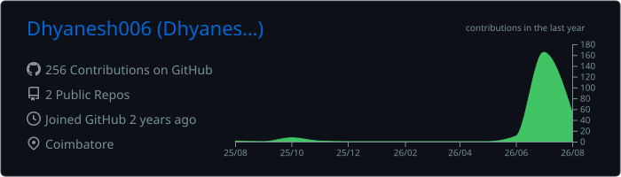
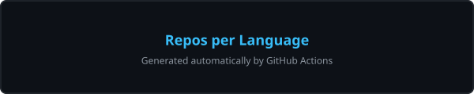
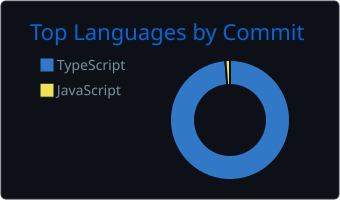
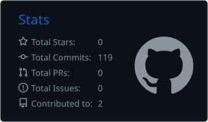
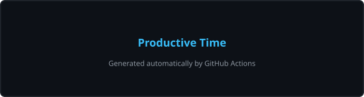

<!--
  ═══════════════════════════════════════════════════════════════════
   GITHUB PROFILE README  ·  Dhyanesh
  ═══════════════════════════════════════════════════════════════════
   ✏️  All placeholders configured: GitHub username (Dhyanesh006),
       LinkedIn, email (dhyanesh006@gmail.com), portfolio.
       Ready to push — no action needed.

       (Spotify and X/Twitter sections are saved as commented blocks
        in this file if you want them later.)

   ⚙️  AFTER the first push, run these workflows once from the
       Actions tab → "Run workflow" so the cards & animation appear:
       1. "Update GitHub Stats Cards"  → commits ./profile/*.svg and
          ./profile-summary-card-output/ into the repo
       2. "Pac-Man Contribution Graph" → pushes the animation to the
          `output` branch
       Both then update automatically every day.

   🔒  For private contributions in the "Productive Time" card, create
       a PAT with `repo` scope and save it as secret
       SUMMARY_GITHUB_TOKEN (see .github/workflows/stats.yml).
  ═══════════════════════════════════════════════════════════════════
-->

<!-- ═══════════ 1 · ANIMATED HEADER  ═══════════ -->

  

<h1 align="center" style="color: #f0f6fc; font-family: 'Segoe UI', sans-serif;">
  Hi, I'm Dhyanesh 👋
</h1>

  

  <em>Building scalable, real-world applications &mdash; one commit at a time.</em>

 

<!-- ═══════════ 2 · HERO BANNER  ═══════════ -->

  

<!-- ═══════════ 3 · ABOUT ME  ═══════════ -->
<h2 align="center" style="color: #38bdf8;">✦ &nbsp;About Me&nbsp; ✦</h2>

  
    
🎓&nbsp;&nbsp;Computer Science Engineering Student

    
💻&nbsp;&nbsp;Passionate Full Stack Developer

    
📚&nbsp;&nbsp;Currently learning Java, Spring Boot &amp; Next.js

    
⚙️&nbsp;&nbsp;Interested in Backend Engineering &amp; System Design

    
🌱&nbsp;&nbsp;Open Source Enthusiast

    
🚀&nbsp;&nbsp;Building scalable applications

    
🧩&nbsp;&nbsp;Loves solving problems

  

 

<!-- ═══════════ 4 · EDUCATION & CERTIFICATIONS  ═══════════ -->
<h2 align="center" style="color: #38bdf8;">🎓 &nbsp;Education &amp; Certifications</h2>

  
    
🎓&nbsp;&nbsp;<b style="color: #60a5fa;">B.E. Computer Science &amp; Engineering</b>&nbsp;&nbsp;(Pursuing)

    
📍&nbsp;&nbsp;Coimbatore, India

    
📜&nbsp;&nbsp;<b style="color: #60a5fa;">Certifications (2024)</b>

    
&nbsp;&nbsp;&nbsp;&nbsp;✔️&nbsp;&nbsp;MongoDB &middot; MATLAB (MathWorks) &middot; Microsoft &middot; Bentley

    
&nbsp;&nbsp;&nbsp;&nbsp;✔️&nbsp;&nbsp;Celonis &middot; Wadhwani Foundation &middot; Professional Development

    
🌐&nbsp;&nbsp;Explorations: Cybersecurity &amp; Cloud Computing

  

 

<!-- ═══════════ 5 · TECH STACK  ═══════════ -->
<h2 align="center" style="color: #38bdf8;">🛠️ &nbsp;Tech Stack</h2>

<b style="color: #a78bfa;">Languages&nbsp; (Java · JavaScript · TypeScript · Python · SQL)</b>

  

<b style="color: #a78bfa;">Frontend</b>

  

<b style="color: #a78bfa;">Backend</b>

  

<b style="color: #a78bfa;">Database</b>

  

<b style="color: #a78bfa;">Cloud &amp; Deployment</b>

  

<b style="color: #a78bfa;">Tools</b>

  

 

<!-- ═══════════ 6 · GITHUB STATS  ═══════════ -->
<!--
  Stats + Top Languages + Summary Cards are generated by GitHub Actions
  (.github/workflows/stats.yml) and committed into this repo, so they
  never depend on flaky third-party hosting.
-->
<h2 align="center" style="color: #38bdf8;">📊 &nbsp;GitHub Stats</h2>

  
  

  

  

  
  
  
  

  

<!-- Trophies are rendered statically (no external service) so they can
     never break. The hosted github-profile-trophy service is currently
     unavailable; swap the block below with this URL if it recovers:
     https://github-profile-trophy.vercel.app/?username=Dhyanesh006&theme=onedark&no-frame=true&row=1 -->
<h3 align="center" style="color: #8b949e;">🏆 &nbsp;GitHub Trophies</h3>

  
    ⭐
    Star
  
  
    💾
    Committer
  
  
    🔀
    Pull Requests
  
  
    🐛
    Issues
  
  
    🚀
    Contributor
  
  
    👥
    Follower
  
  
    🏆
    Trophy
  

 

<!-- ═══════════ 7 · CURRENT FOCUS  ═══════════ -->
<h2 align="center" style="color: #38bdf8;">🎯 &nbsp;Current Focus</h2>

  
    
<b style="color: #8b949e;">Currently Learning</b>

    
✔️&nbsp;&nbsp;Data Structures &amp; Algorithms

    
✔️&nbsp;&nbsp;Java

    
✔️&nbsp;&nbsp;Spring Boot

    
✔️&nbsp;&nbsp;Next.js

    
✔️&nbsp;&nbsp;System Design

    
✔️&nbsp;&nbsp;Backend Development

  

 

<!-- ═══════════ 8 · FEATURED PROJECTS  ═══════════ -->
<h2 align="center" style="color: #38bdf8;">📌 &nbsp;Featured Projects</h2>

  
    <b style="color: #60a5fa;">📁 Portfolio</b>
    
My personal portfolio built with Next.js &amp; Tailwind CSS.

    <a href="https://github.com/Dhyanesh006/Dhyanesh006" style="color: #38bdf8; text-decoration: none;">View Repo →</a>
  

  
    <b style="color: #60a5fa;">🍽️ Food Review Platform</b>
    
Full stack app built with Spring Boot &amp; React.

    <a href="https://github.com/Dhyanesh006" style="color: #38bdf8; text-decoration: none;">View Repo →</a>
  

  
    <b style="color: #60a5fa;">🏠 Rental Platform</b>
    
Property rental platform using the MERN stack.

    <a href="https://github.com/Dhyanesh006" style="color: #38bdf8; text-decoration: none;">View Repo →</a>
  

  
    <b style="color: #60a5fa;">☕ Java Spring Boot Projects</b>
    
A collection of REST APIs built with Java &amp; Spring Boot.

    <a href="https://github.com/Dhyanesh006" style="color: #38bdf8; text-decoration: none;">View Repo →</a>
  

  
    <b style="color: #60a5fa;">🤖 Machine Learning Projects</b>
    
ML models and notebooks built with Python.

    <a href="https://github.com/Dhyanesh006" style="color: #38bdf8; text-decoration: none;">View Repo →</a>
  

 

<!-- ═══════════ 9 · RANDOM DEV QUOTE  ═══════════ -->
<h2 align="center" style="color: #38bdf8;">💬 &nbsp;Random Dev Quote</h2>

  

 

<!-- ═══════════ 10 · SPOTIFY — HIDDEN FOR LATER  ═══════════
  Uncomment this whole block to show "Now Playing on Spotify":
  1. Authorize at: https://spotify-github-profile.kittinanx.com/api/login
  2. Replace YOUR_SPOTIFY_USER_ID with your Spotify user ID below.

<h2 align="center" style="color: #38bdf8;">🎧 &nbsp;Now Playing on Spotify</h2>

  
    
Spotify card appears here once you connect your account.

    <a href="https://spotify-github-profile.kittinanx.com/api/login" style="color: #22d3ee; text-decoration: none;">Connect with Spotify →</a>
  

  

-->

 

<!-- ═══════════ 11 · CONNECT WITH ME  ═══════════ -->
<h2 align="center" style="color: #38bdf8;">🤝 &nbsp;Connect With Me</h2>

  
  
  

<!-- X/Twitter — hidden for now. Uncomment the block below to bring it back:
  
-->

 

<!-- ═══════════ 12 · VISITOR COUNTER  ═══════════ -->
<h2 align="center" style="color: #38bdf8;">👀 &nbsp;Profile Visitors</h2>

  

 

<!-- ═══════════ 13 · CONTRIBUTION ACTIVITY GRAPH (shown in section 6)  ═══════════ -->
<!-- The GitHub activity graph is displayed above in the GitHub Stats section. -->

<!-- ═══════════ 14 · PAC-MAN CONTRIBUTION ANIMATION  ═══════════ -->
<h2 align="center" style="color: #38bdf8;">👻 &nbsp;Pac-Man Contribution Animation</h2>

  <picture>
    <source media="(prefers-color-scheme: dark)" srcset="https://raw.githubusercontent.com/Dhyanesh006/Dhyanesh006/output/pacman-contribution-graph-dark.svg" />
    <source media="(prefers-color-scheme: light)" srcset="https://raw.githubusercontent.com/Dhyanesh006/Dhyanesh006/output/pacman-contribution-graph.svg" />
    
  </picture>

  <em>Auto-generated daily by <a href=".github/workflows/pacman.yml" style="color: #38bdf8;">GitHub Actions</a> using
  <a href="https://github.com/abozanona/pacman-contribution-graph" style="color: #38bdf8;">abozanona/pacman-contribution-graph</a></em>

 

<!-- ═══════════ 15 · FOOTER  ═══════════ -->

  Thanks for visiting!  Have a great day!

  © 2026 Dhyanesh · Built with ❤️ &amp; ☕

