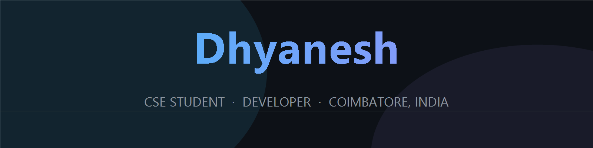

<!--
  ÔòÉÔòÉÔòÉÔòÉÔòÉÔòÉÔòÉÔòÉÔòÉÔòÉÔòÉÔòÉÔòÉÔòÉÔòÉÔòÉÔòÉÔòÉÔòÉÔòÉÔòÉÔòÉÔòÉÔòÉÔòÉÔòÉÔòÉÔòÉÔòÉÔòÉÔòÉÔòÉÔòÉÔòÉÔòÉÔòÉÔòÉÔòÉÔòÉÔòÉÔòÉÔòÉÔòÉÔòÉÔòÉÔòÉÔòÉÔòÉÔòÉÔòÉÔòÉÔòÉÔòÉÔòÉÔòÉÔòÉÔòÉÔòÉÔòÉÔòÉÔòÉÔòÉÔòÉÔòÉÔòÉÔòÉÔòÉ
   GITHUB PROFILE README  ┬À  Dhyanesh
  ÔòÉÔòÉÔòÉÔòÉÔòÉÔòÉÔòÉÔòÉÔòÉÔòÉÔòÉÔòÉÔòÉÔòÉÔòÉÔòÉÔòÉÔòÉÔòÉÔòÉÔòÉÔòÉÔòÉÔòÉÔòÉÔòÉÔòÉÔòÉÔòÉÔòÉÔòÉÔòÉÔòÉÔòÉÔòÉÔòÉÔòÉÔòÉÔòÉÔòÉÔòÉÔòÉÔòÉÔòÉÔòÉÔòÉÔòÉÔòÉÔòÉÔòÉÔòÉÔòÉÔòÉÔòÉÔòÉÔòÉÔòÉÔòÉÔòÉÔòÉÔòÉÔòÉÔòÉÔòÉÔòÉÔòÉÔòÉ
   ԣŴ©Å  All placeholders configured: GitHub username (Dhyanesh006),
       LinkedIn, email (dhyanesh006@gmail.com), portfolio.
       Ready to push ÔÇö no action needed.

       (Spotify and X/Twitter sections are saved as commented blocks
        in this file if you want them later.)

   ÔÜÖ´©Å  AFTER the first push, run these workflows once from the
       Actions tab  "Run workflow" so the cards & animation appear:
       1. "Update GitHub Stats Cards"   commits ./profile/*.svg and
          ./profile-summary-card-output/ into the repo
       2. "Pac-Man Contribution Graph"  pushes the animation to the
          `output` branch
       Both then update automatically every day.

   ­ƒöÆ  For private contributions in the "Productive Time" card, create
       a PAT with `repo` scope and save it as secret
       SUMMARY_GITHUB_TOKEN (see .github/workflows/stats.yml).
  ÔòÉÔòÉÔòÉÔòÉÔòÉÔòÉÔòÉÔòÉÔòÉÔòÉÔòÉÔòÉÔòÉÔòÉÔòÉÔòÉÔòÉÔòÉÔòÉÔòÉÔòÉÔòÉÔòÉÔòÉÔòÉÔòÉÔòÉÔòÉÔòÉÔòÉÔòÉÔòÉÔòÉÔòÉÔòÉÔòÉÔòÉÔòÉÔòÉÔòÉÔòÉÔòÉÔòÉÔòÉÔòÉÔòÉÔòÉÔòÉÔòÉÔòÉÔòÉÔòÉÔòÉÔòÉÔòÉÔòÉÔòÉÔòÉÔòÉÔòÉÔòÉÔòÉÔòÉÔòÉÔòÉÔòÉÔòÉ
-->

<!-- ÔòÉÔòÉÔòÉÔòÉÔòÉÔòÉÔòÉÔòÉÔòÉÔòÉÔòÉ 1 ┬À ANIMATED HEADER  ÔòÉÔòÉÔòÉÔòÉÔòÉÔòÉÔòÉÔòÉÔòÉÔòÉÔòÉ -->

  

  

  

  <em>Building scalable, real-world applications &mdash; one commit at a time.</em>

 

<!-- ÔòÉÔòÉÔòÉÔòÉÔòÉÔòÉÔòÉÔòÉÔòÉÔòÉÔòÉ 3 ┬À ABOUT ME  ÔòÉÔòÉÔòÉÔòÉÔòÉÔòÉÔòÉÔòÉÔòÉÔòÉÔòÉ -->
<h2 align="left" style="color: #38bdf8;"> &nbsp;About Me&nbsp; </h2>

  
    
­ƒÄô&nbsp;&nbsp;B.E. Computer Science &amp; Engineering Student

    
­ƒÆ╗&nbsp;&nbsp;Full-stack developer &mdash; Java, Spring Boot, React &amp; modern web

    
­ƒøí´©Å&nbsp;&nbsp;Cybersecurity learner &amp; ethical hacking explorer

    
Ôÿü´©Å&nbsp;&nbsp;Networking &amp; Cloud (AWS) enthusiast

    
­ƒøá´©Å&nbsp;&nbsp;Building end-to-end, scalable applications

    
­ƒº®&nbsp;&nbsp;Loves solving problems

  

 

<!-- ÔòÉÔòÉÔòÉÔòÉÔòÉÔòÉÔòÉÔòÉÔòÉÔòÉÔòÉ 4 ┬À EDUCATION & CERTIFICATIONS  ÔòÉÔòÉÔòÉÔòÉÔòÉÔòÉÔòÉÔòÉÔòÉÔòÉÔòÉ -->
<h2 align="left" style="color: #38bdf8;">­ƒÄô &nbsp;Education &amp; Certifications</h2>

  
    
­ƒÄô&nbsp;&nbsp;<b style="color: #60a5fa;">B.E. Computer Science &amp; Engineering</b>&nbsp;&nbsp;(Pursuing)

    
­ƒôì&nbsp;&nbsp;Coimbatore, India

    
­ƒô£&nbsp;&nbsp;<b style="color: #60a5fa;">Certifications (2024)</b>

    
&nbsp;&nbsp;&nbsp;&nbsp;Ô£ö´©Å&nbsp;&nbsp;MongoDB &middot; MATLAB (MathWorks) &middot; Microsoft &middot; Bentley

    
&nbsp;&nbsp;&nbsp;&nbsp;Ô£ö´©Å&nbsp;&nbsp;Celonis &middot; Wadhwani Foundation &middot; Professional Development

    
­ƒîÉ&nbsp;&nbsp;Explorations: Cybersecurity &amp; Cloud Computing

  

 

<!-- ÔòÉÔòÉÔòÉÔòÉÔòÉÔòÉÔòÉÔòÉÔòÉÔòÉÔòÉ 5 ┬À TECH STACK  ÔòÉÔòÉÔòÉÔòÉÔòÉÔòÉÔòÉÔòÉÔòÉÔòÉÔòÉ -->
<h2 align="center" style="color: #38bdf8;">­ƒøá´©Å &nbsp;Tech Stack</h2>

<b style="color: #60a5fa;">Languages&nbsp; (Java ┬À Python ┬À JavaScript ┬À TypeScript)</b>

  

<b style="color: #60a5fa;">Frontend</b>

  

<b style="color: #60a5fa;">Backend&nbsp; (Spring Boot ┬À REST APIs ┬À Node.js)</b>

  

<b style="color: #60a5fa;">Database&nbsp; (MySQL ┬À MongoDB)</b>

  

<b style="color: #60a5fa;">Tools&nbsp; (Git ┬À GitHub ┬À VS Code ┬À Docker ┬À Linux ┬À Power BI)</b>

  

<b style="color: #60a5fa;">Networking &amp; Cloud&nbsp; (Networking ┬À AWS)</b>

  

<b style="color: #60a5fa;">Cybersecurity&nbsp; (Cybersecurity ┬À Ethical Hacking)</b>

 

<!-- ÔòÉÔòÉÔòÉÔòÉÔòÉÔòÉÔòÉÔòÉÔòÉÔòÉÔòÉ 6 ┬À GITHUB STATS  ÔòÉÔòÉÔòÉÔòÉÔòÉÔòÉÔòÉÔòÉÔòÉÔòÉÔòÉ -->
<!--
  Stats + Top Languages + Summary Cards are generated by GitHub Actions
  (.github/workflows/stats.yml) and committed into this repo, so they
  never depend on flaky third-party hosting.
-->
<h2 align="center" style="color: #38bdf8;">­ƒôè &nbsp;GitHub Stats</h2>

  
  

  

  

  
  
  
  

 

<!-- Trophies are rendered statically (no external service) so they can
     never break. The hosted github-profile-trophy service is currently
     unavailable; swap the block below with this URL if it recovers:
     https://github-profile-trophy.vercel.app/?username=Dhyanesh006&theme=onedark&no-frame=true&row=1 -->
<h3 align="center" style="color: #8b949e;">­ƒÅå &nbsp;GitHub Trophies</h3>

  
    Ô¡É
    Star
  
  
    ­ƒÆ¥
    Committer
  
  
    ­ƒöÇ
    Pull Requests
  
  
    ­ƒÉø
    Issues
  
  
    ­ƒÜÇ
    Contributor
  
  
    ­ƒæÑ
    Follower
  
  
    ­ƒÅå
    Trophy
  

 

<!-- ÔòÉÔòÉÔòÉÔòÉÔòÉÔòÉÔòÉÔòÉÔòÉÔòÉÔòÉ 7 ┬À CURRENT FOCUS  ÔòÉÔòÉÔòÉÔòÉÔòÉÔòÉÔòÉÔòÉÔòÉÔòÉÔòÉ -->
<h2 align="left" style="color: #38bdf8;">­ƒÄ» &nbsp;Current Focus</h2>

  
    
<b style="color: #8b949e;">Currently Learning</b>

    
Ô£ö´©Å&nbsp;&nbsp;Java &amp; Spring Boot (Backend)

    
Ô£ö´©Å&nbsp;&nbsp;React &amp; Next.js

    
Ô£ö´©Å&nbsp;&nbsp;Cybersecurity &amp; Ethical Hacking

    
Ô£ö´©Å&nbsp;&nbsp;Networking

    
Ô£ö´©Å&nbsp;&nbsp;Cloud Computing (AWS)

    
Ô£ö´©Å&nbsp;&nbsp;System Design

  

 

<!-- ÔòÉÔòÉÔòÉÔòÉÔòÉÔòÉÔòÉÔòÉÔòÉÔòÉÔòÉ 8 ┬À FEATURED PROJECTS  ÔòÉÔòÉÔòÉÔòÉÔòÉÔòÉÔòÉÔòÉÔòÉÔòÉÔòÉ -->
<h2 align="center" style="color: #38bdf8;">­ƒôî &nbsp;Featured Projects</h2>

  
    <b style="color: #60a5fa;">­ƒÜÇ GitHub Profile Repo</b>
    
This profile ÔÇö animated contribution graph, live stats cards &amp; GitHub Actions.

    <a href="https://github.com/Dhyanesh006/Dhyanesh006" style="color: #38bdf8; text-decoration: none;">View Repo </a>
  

  
    <b style="color: #60a5fa;">­ƒîÉ Portfolio</b>
    
Personal portfolio website built with Next.js &amp; Tailwind CSS.

    <a href="https://github.com/Dhyanesh006/portfolio" style="color: #38bdf8; text-decoration: none;">View Repo </a>
  

  
    <b style="color: #60a5fa;">­ƒÅá Rental Hub ­ƒöÆ</b>
    
Property rental management platform ÔÇö TypeScript monorepo (Next.js, React, NestJS).

    <a href="https://github.com/Dhyanesh006/Rental_Hub" style="color: #38bdf8; text-decoration: none;">View Repo </a>
  

  
    <b style="color: #60a5fa;">­ƒøÆ PCStore ­ƒöÆ</b>
    
E-commerce platform for PC parts ÔÇö Java, Spring Boot &amp; MySQL.

    <a href="https://github.com/Dhyanesh006/pcstore" style="color: #38bdf8; text-decoration: none;">View Repo </a>
  

 

<!-- ÔòÉÔòÉÔòÉÔòÉÔòÉÔòÉÔòÉÔòÉÔòÉÔòÉÔòÉ 9 ┬À QUOTES  ÔòÉÔòÉÔòÉÔòÉÔòÉÔòÉÔòÉÔòÉÔòÉÔòÉÔòÉ -->
<h2 align="center" style="color: #38bdf8;">­ƒÆ¼ &nbsp;Quotes</h2>

  <!-- QUOTE:START -->
  <em>&ldquo;The flow of time is always cruel, but its speed seems different for each person.&rdquo;</em>
   
  &mdash; The Legend of Zelda: Majora's Mask (Game)
  <!-- QUOTE:END -->

 

<!-- ÔòÉÔòÉÔòÉÔòÉÔòÉÔòÉÔòÉÔòÉÔòÉÔòÉÔòÉ 10 ┬À SPOTIFY ÔÇö HIDDEN FOR LATER  ÔòÉÔòÉÔòÉÔòÉÔòÉÔòÉÔòÉÔòÉÔòÉÔòÉÔòÉ
  Uncomment this whole block to show "Now Playing on Spotify":
  1. Authorize at: https://spotify-github-profile.kittinanx.com/api/login
  2. Replace YOUR_SPOTIFY_USER_ID with your Spotify user ID below.

<h2 align="center" style="color: #38bdf8;">­ƒÄº &nbsp;Now Playing on Spotify</h2>

  
    
Spotify card appears here once you connect your account.

    <a href="https://spotify-github-profile.kittinanx.com/api/login" style="color: #60a5fa; text-decoration: none;">Connect with Spotify </a>
  

  

-->

 

<!-- ÔòÉÔòÉÔòÉÔòÉÔòÉÔòÉÔòÉÔòÉÔòÉÔòÉÔòÉ 11 ┬À CONNECT WITH ME  ÔòÉÔòÉÔòÉÔòÉÔòÉÔòÉÔòÉÔòÉÔòÉÔòÉÔòÉ -->
<h2 align="center" style="color: #38bdf8;">­ƒñØ &nbsp;Connect With Me</h2>

  
  
  

<!-- X/Twitter ÔÇö hidden for now. Uncomment the block below to bring it back:
  
-->

 

<!-- ÔòÉÔòÉÔòÉÔòÉÔòÉÔòÉÔòÉÔòÉÔòÉÔòÉÔòÉ 12 ┬À VISITOR COUNTER  ÔòÉÔòÉÔòÉÔòÉÔòÉÔòÉÔòÉÔòÉÔòÉÔòÉÔòÉ -->
<h2 align="center" style="color: #38bdf8;">­ƒæÇ &nbsp;Profile Visitors</h2>

  

 

<!-- ÔòÉÔòÉÔòÉÔòÉÔòÉÔòÉÔòÉÔòÉÔòÉÔòÉÔòÉ 13 ┬À CONTRIBUTION ACTIVITY GRAPH (shown in section 6)  ÔòÉÔòÉÔòÉÔòÉÔòÉÔòÉÔòÉÔòÉÔòÉÔòÉÔòÉ -->
<!-- The GitHub activity graph is displayed above in the GitHub Stats section. -->

<!-- ÔòÉÔòÉÔòÉÔòÉÔòÉÔòÉÔòÉÔòÉÔòÉÔòÉÔòÉ 14 ┬À PAC-MAN CONTRIBUTION ANIMATION  ÔòÉÔòÉÔòÉÔòÉÔòÉÔòÉÔòÉÔòÉÔòÉÔòÉÔòÉ -->
<h2 align="center" style="color: #38bdf8;">­ƒæ╗ &nbsp;Contribution</h2>

  <picture>
    <source media="(prefers-color-scheme: dark)" srcset="https://raw.githubusercontent.com/Dhyanesh006/Dhyanesh006/output/pacman-contribution-graph-dark.svg" />
    <source media="(prefers-color-scheme: light)" srcset="https://raw.githubusercontent.com/Dhyanesh006/Dhyanesh006/output/pacman-contribution-graph.svg" />
    
  </picture>

 
